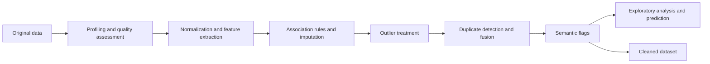

# DIQ Project 2025–2026

Data quality analysis of the Comune di Milano dataset **Pubblici esercizi fuori piano**, developed for **[056490] Data and Information Quality** at Politecnico di Milano, academic year 2025–2026.

The project covers data profiling, quality assessment, text and address normalization, missing-value imputation, outlier treatment, duplicate detection, data fusion and exploratory predictive analysis. The dataset describes establishments where food and beverage service operates within another primary activity, such as schools, companies, cultural venues or sports facilities.

**Authors:** [Andrea Nardi](https://github.com/NrdAnd), [Christian Giovanni Pesaturo](https://github.com/ChristianPesaturo), [Andrea Pinessi](https://github.com/AndreaPinessi).

**Course advisor:** Prof. Cinzia Cappiello. **Teaching assistant:** Camilla Sancricca.

## Project material

| Resource | Contents |
| --- | --- |
| [Notebook](DIQ_Project25_26_v5.ipynb) | Complete analysis and cleaning workflow |
| [Report](DIQ_Project.pdf) | Project report |
| [Methodology](METHODOLOGY.md) | Processing steps, algorithms and parameters |
| [Data](DATA.md) | File formats, field definitions and sources |
| [Results](RESULTS.md) | Dataset statistics and notebook experiments |
| [Reproducibility](REPRODUCIBILITY.md) | Environment setup and execution instructions |

## Workflow



The input contains **2,070 records and 12 attributes**. The cleaned CSV included at the repository root contains **1,636 records and 35 attributes**, comprising descriptive fields, 20 Boolean activity indicators and two diagnostic fields. See [RESULTS.md](RESULTS.md) for the corresponding statistics.

## Quick start

Use **Python 3.11** and run the following commands from the repository root:

```bash
python3.11 -m venv .venv
source .venv/bin/activate
python -m pip install -r requirements.txt
python scripts/validate_repository.py
python scripts/execute_notebook.py
```

On Windows, activate the environment with `.venv\Scripts\Activate.ps1`. For interactive execution, run `python -m jupyterlab` and open the notebook.

Execution uses the CPU and cached geographic responses. Generated notebooks and datasets are saved under `generated/`. Detailed instructions and optional Graphviz setup are in [REPRODUCIBILITY.md](REPRODUCIBILITY.md).

## Structure

```text
.
├── DIQ_Project25_26_v5.ipynb
├── DIQ_Project.pdf
├── Comune-di-Milano-Pubblici-esercizi-fuori-piano.csv
├── Cleaned_Comune-di-Milano-Pubblici-esercizi-fuori-piano.csv
├── README.md, METHODOLOGY.md, DATA.md, RESULTS.md, REPRODUCIBILITY.md
├── LICENSE, CITATION.cff
├── requirements.txt, requirements-lock.txt
├── archive/         # previous notebook and dataset versions
├── provenance/      # file checksums and cached geographic responses
├── scripts/         # notebook execution and repository checks
└── .github/         # continuous integration
```

## License and citation

Original code and documentation are released under the [MIT License](LICENSE), with the authors' copyright and permission notice retained in copies or substantial portions. Third-party data and material retain their own terms; source attribution is provided in [DATA.md](DATA.md).

Citation metadata is available in [CITATION.cff](CITATION.cff).
